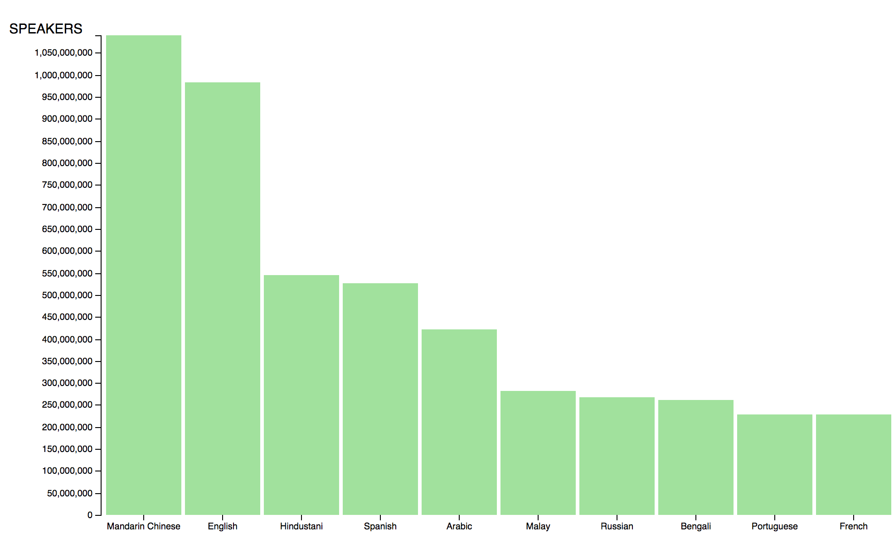

# Sup
[Link to visualisation](https://meesrutten.github.io/fe3/)
So this is a short description about the project.
This graphic displays the number of people who speak a certain language.

***
## Data
I used a tsv file with languages and amount of speakers of the corresponding language.

***
## Features
- d3.scaleBand() - https://github.com/d3/d3-scale#scaleBand
- d3.scaleLinear() - https://github.com/d3/d3-scale#scaleLinear
-  d3.axis(left, bottom) - https://github.com/d3/d3-axis#axisLeft - https://github.com/d3/d3-axis#axisBottom
- bandWidth() - https://github.com/d3/d3-scale#band_bandwidth
- transition - https://github.com/d3/d3-transition

## Setup
I used Yeomann Web App generator because I find that it works quite fast for small projects, the setup doesn't have a bunch of clutter and it contains browser-sync which is nice to have.

## Style
I wanted to create some animated bars to simulate the feeling of fluctuation because this data is a rough estimate and always changing. That's why I went with a "slime" like color and elastic easing.

***
### License
Creative Commons
