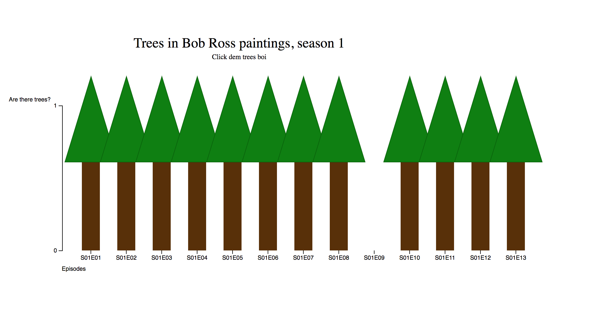

# Sup
[Link to visualisation](https://meesrutten.github.io/fe3-assessment-2/)
So this is a short description about the project.
This graphic displays if there were trees in Bob Ross' paintings in Season 1 of his series.

***
## Data
I used a csv file with information about Bob Ross' paintings

***
## Features
- d3.scaleBand() - https://github.com/d3/d3-scale#scaleBand
- d3.scaleLinear() - https://github.com/d3/d3-scale#scaleLinear
-  d3.axis(left, bottom) - https://github.com/d3/d3-axis#axisLeft - https://github.com/d3/d3-axis#axisBottom
- bandWidth() - https://github.com/d3/d3-scale#band_bandwidth
- transition - https://github.com/d3/d3-transition

## Setup
I used Yeomann Web App generator because I find that it works quite fast for small projects, the setup doesn't have a bunch of clutter and it contains browser-sync which is nice to have.

## Style
I made the bars look like trees because that seemed funny to me. I added a transition when you click on the trees and a pop up when you hover over them with the title of that episode.

## Cleaning data
I cleaned most of the data with:
doc.replace( doc.substring( start, end ), '' )
where doc is the data and start/end are variables

***
### License
Creative Commons
